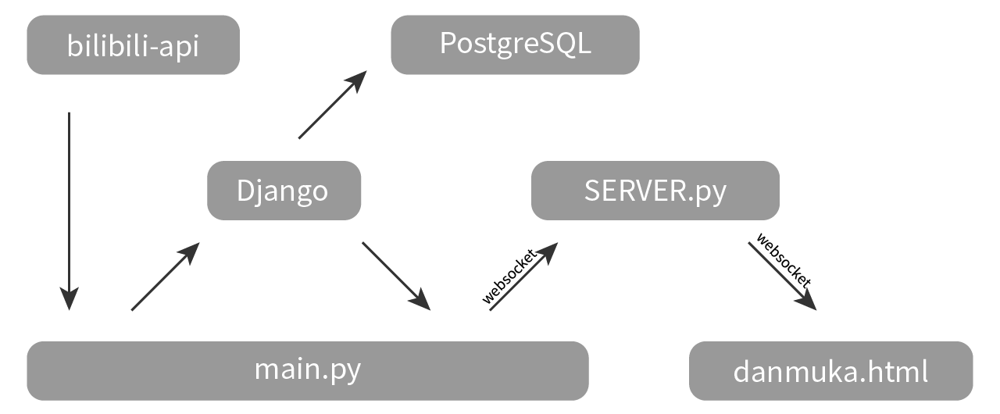

# 

## 大概是这么运行的


## 要先搞定这些项目

``` sh
# Python3
apt install python3 python3-pip
# PyPI
pip3 install django
pip3 install websockets
# bilibili-api (https://github.com/MoyuScript/bilibili-api)
pip3 install bilibili-api
```

## 然后这么用

``` sh
```

## 模型

去这里看→ [模型](docs/models.md)